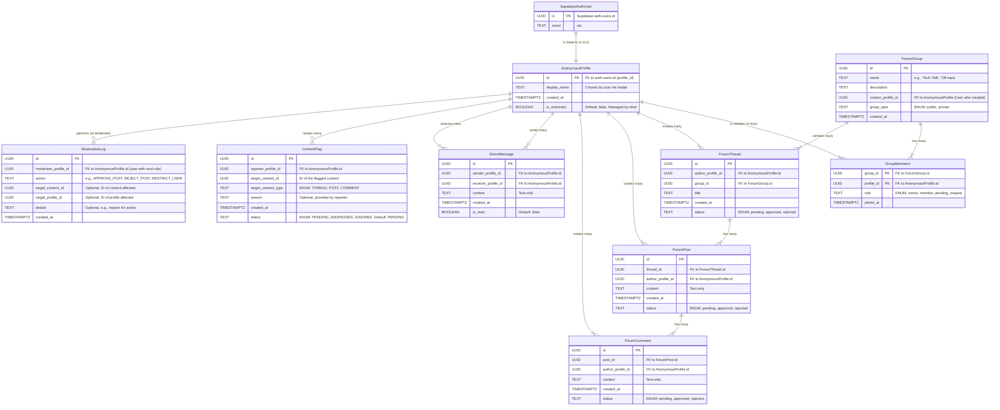

# Diagrama de Entidade-Relacionamento (ERD)

**Explicação do Diagrama ERD:**

- `SupabaseAuthUser`: Representa a tabela `auth.users` do Supabase, onde a autenticação real acontece.
- `AnonymousProfile`: O perfil anônimo do usuário no fórum, ligado ao `SupabaseAuthUser`. É quem interage (cria threads, posts, etc.). Contém o `display_name` escolhido pelo usuário via modal e um status `is_restricted`. **IMPORTANTE:** A criação do perfil agora é manual, iniciada pelo frontend quando o usuário acessa o fórum pela primeira vez.
- `ForumGroup`: Grupos que podem ser criados por qualquer usuário. Incluem o campo `group_type` que determina se são `public` (entrada imediata) ou `private` (requer aprovação).
- `GroupMembers`: Tabela de junção para associar `AnonymousProfile`s a `ForumGroup`s. Inclui o campo `role` que define o papel do usuário: `owner` (criador), `member` (membro aprovado) ou `pending_request` (aguardando aprovação para grupos privados).
- `ForumThread`: Os tópicos principais de discussão dentro de grupos. Incluem o campo `status` com valores simplificados: `pending`, `approved`, `rejected`.
- `ForumPost`: As mensagens dentro de uma `ForumThread`. O primeiro post de uma thread também é um `ForumPost`. Incluem o campo `status` simplificado.
- `ForumComment`: Respostas a `ForumPost`s. Incluem o campo `status` simplificado.
- `DirectMessage`: Mensagens privadas entre dois `AnonymousProfile`s.
- `ContentFlag`: Registros de conteúdo sinalizado por usuários para conteúdo que já foi aprovado e está público. `target_content_id` e `target_content_type` indicam o que foi sinalizado.
- `ModerationLog`: Logs das ações tomadas pelos moderadores/administradores.

### Fluxos de Interação e Segurança (Complemento ao ERD)

O ERD mostra a estrutura, mas os fluxos e a segurança são dinâmicos:

1.  **Autenticação e Criação de Perfil Anônimo (NOVO FLUXO):**

    - Usuário se cadastra/loga via Supabase Auth (Next.js frontend).
    - **MUDANÇA IMPORTANTE:** Na primeira vez que o usuário acessar a página do fórum, um modal aparecerá para escolha do nickname.
    - Frontend verifica se existe `AnonymousProfile` para o usuário. Se não existir, exibe modal.
    - Após escolha do nickname, frontend cria o `AnonymousProfile` associado ao `auth.users.id`.
    - **RLS:** A política na tabela `AnonymousProfile` garante que um usuário só possa ler/modificar seu próprio perfil (e que PII do `auth.users` não seja exposto).

2.  **Criação de Grupos (NOVA FUNCIONALIDADE):**

    - Qualquer usuário autenticado pode criar um grupo via frontend.
    - Durante a criação, o usuário define se o grupo é `public` ou `private`.
    - O criador automaticamente torna-se `owner` na tabela `GroupMembers`.
    - **RLS:** Políticas controlam a visibilidade dos grupos e permissões de entrada.

3.  **Adesão a Grupos (NOVA FUNCIONALIDADE):**

    - **Grupos Públicos:** Usuário clica em "Entrar" e é adicionado automaticamente como `member`.
    - **Grupos Privados:** Usuário clica em "Solicitar Entrada" e é adicionado como `pending_request`. O `owner` pode aprovar ou negar via painel de gerenciamento.
    - **RLS:** Verificações garantem que apenas usuários aprovados podem ver conteúdo de grupos privados.

4.  **Criação de Conteúdo (Threads, Posts, Comentários):**

    - Usuário (com seu `AnonymousProfile`) cria conteúdo dentro de um grupo específico.
    - A requisição vai para o Supabase com `status: 'pending'`.
    - **RLS:** Políticas verificam:
      - Se o `author_profile_id` corresponde ao `AnonymousProfile` do usuário autenticado.
      - Se o usuário não está `is_restricted`.
      - Se o usuário é membro do grupo onde está tentando postar.

5.  **Moderação Simplificada (FLUXO ATUALIZADO):**

    - IA analisa conteúdo automaticamente após criação.
    - **Se aprovado:** Status muda para `approved` e conteúdo fica visível.
    - **Se rejeitado:** Status muda para `rejected` (exclusão lógica) e conteúdo permanece invisível.
    - **Painel Admin:** Administradores podem visualizar posts `rejected` e decidir por exclusão permanente ou reversão da decisão (aprovar).

6.  **Visualização de Conteúdo:**

    - **RLS:** Políticas de `SELECT` determinam o que é visível:
      - Conteúdo só é visível se `status = 'approved'`.
      - Para grupos privados, usuário deve ser membro com `role = 'member'` ou `role = 'owner'`.
      - Autor pode ver próprio conteúdo independente do status.
    - **Supabase Realtime:** Usado para atualizações ao vivo em threads e DMs, respeitando as RLS.

7.  **Mensagens Diretas (DMs):**

    - Usuário A envia DM para Usuário B.
    - **RLS:** Na tabela `DirectMessage`, a política garante que apenas o `sender_profile_id` e o `receiver_profile_id` possam ler a mensagem.

8.  **Flagging de Conteúdo:**

    - Usuário (via `AnonymousProfile`) sinaliza um post/comentário que já está aprovado e público.
    - **RLS:** Permite que qualquer `AnonymousProfile` autenticado crie uma `ContentFlag`. Apenas moderadores podem ver todas as flags pendentes.

9.  **Moderação (Painel Admin e Ações):**
    - Administrador acessa painel para gerenciar posts rejeitados.
    - Painel lista posts com `status = 'rejected'` e `ContentFlag`s pendentes.
    - Para ações privilegiadas:
      - O frontend chama uma **Supabase Edge Function**.
      - **Edge Function:**
        - Verifica se o chamador é um administrador autorizado.
        - Usa a `service_role_key` do Supabase para bypassar RLS e executar ações privilegiadas.
        - Registra a ação na tabela `ModerationLog`.
    - **RLS na** `ModerationLog`**:** Apenas administradores podem ler todos os logs.
