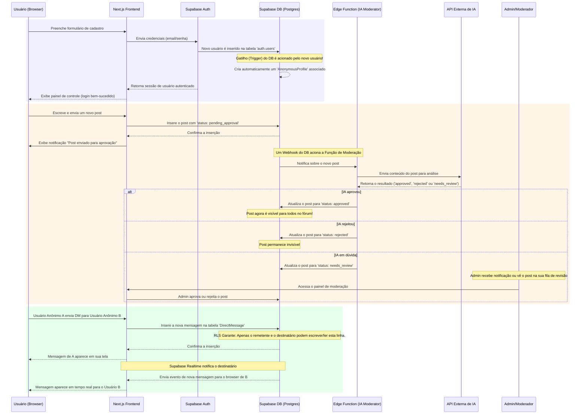

# Diagrama de Sequência - Fluxos de Interação

Este documento apresenta os principais fluxos de interação do sistema de fórum anônimo, ilustrando como os componentes se comunicam para implementar as funcionalidades core da plataforma.

## Visão Geral dos Fluxos

O diagrama abaixo mostra três fluxos fundamentais:

1. **🔐 Cadastro e Criação de Perfil Anônimo** - Como usuários são onboardados no sistema
2. **📝 Criação de Post com Moderação Pré-Publicação** - O novo fluxo de moderação automatizada por IA
3. **💬 Envio de Mensagem Direta (DM)** - Comunicação privada entre usuários anônimos



---

## Detalhamento dos Fluxos

### 🔐 **Fluxo 1: Cadastro e Criação de Perfil Anônimo**

**Objetivo:** Estabelecer a identidade anônima do usuário no sistema, mantendo a privacidade enquanto permite interação.

#### **Passos Técnicos:**

1. **Frontend Validation:** Next.js valida formulário no cliente
2. **Authentication:** Supabase Auth processa credenciais seguramente
3. **Database Insert:** Novo registro em `auth.users` (gerenciado pelo Supabase)
4. **Trigger Automático:**
   ```sql
   -- Trigger que executa automaticamente
   CREATE OR REPLACE FUNCTION handle_new_anonymous_profile()
   RETURNS trigger AS $$
   BEGIN
     INSERT INTO anonymous_profiles (id, user_id, display_name)
     VALUES (NEW.id, NEW.id, generate_anonymous_name());
     RETURN NEW;
   END;
   $$ LANGUAGE plpgsql SECURITY DEFINER;
   ```
5. **Session Management:** JWT token gerado para autenticação subsequente

#### **Segurança e Privacy:**

- **PII Protection:** Email fica apenas em `auth.users` (não exposto)
- **Anonymous Identity:** `display_name` gerado automaticamente (ex: "Anonymous_Fox_123")
- **RLS Enforcement:** Políticas garantem que usuário só acessa próprio perfil

---

### 📝 **Fluxo 2: Criação de Post com Moderação Pré-Publicação**

**Objetivo:** Implementar moderação automatizada que bloqueia conteúdo inadequado antes da publicação, reduzindo carga manual dos moderadores.

#### **Passos Técnicos:**

1. **Content Submission:**

   ```typescript
   // Server Action para criar post
   const { data, error } = await supabase.from("forum_posts").insert({
     content: postContent,
     author_profile_id: userAnonymousId,
     status: "pending_approval", // Sempre começa pendente
   });
   ```

2. **Database Webhook:** Trigger aciona Edge Function

   ```sql
   -- Webhook configuration
   CREATE OR REPLACE FUNCTION notify_new_post()
   RETURNS trigger AS $$
   BEGIN
     PERFORM net.http_post(
       url := 'https://[project].supabase.co/functions/v1/moderate-post',
       body := json_build_object('post_id', NEW.id, 'content', NEW.content)
     );
     RETURN NEW;
   END;
   $$;
   ```

3. **AI Analysis:** Edge Function processa conteúdo

   ```typescript
   // Exemplo de integração com Google Gemini
   const response = await fetch(
     "https://generativelanguage.googleapis.com/v1beta/models/gemini-pro:generateContent",
     {
       method: "POST",
       headers: {
         Authorization: `Bearer ${API_KEY}`,
         "Content-Type": "application/json",
       },
       body: JSON.stringify({
         contents: [
           {
             parts: [
               {
                 text: `Analise este conteúdo para moderação: "${content}"`,
               },
             ],
           },
         ],
       }),
     }
   );
   ```

4. **Status Update:** Baseado na resposta da IA
   - `approved`: Conteúdo liberado automaticamente
   - `rejected`: Conteúdo bloqueado (não visível)
   - `needs_review`: Enviado para fila de moderação manual

#### **Vantagens do Fluxo:**

- **Prevenção Proativa:** Conteúdo inadequado nunca fica público
- **Eficiência:** ~90% dos posts podem ser processados automaticamente
- **Qualidade:** Moderadores focam apenas em casos ambíguos

---

### 💬 **Fluxo 3: Envio de Mensagem Direta (DM)**

**Objetivo:** Permitir comunicação privada 1-a-1 entre usuários anônimos, mantendo privacidade total.

#### **Passos Técnicos:**

1. **Message Creation:**

   ```typescript
   const { data, error } = await supabase.from("direct_messages").insert({
     sender_profile_id: senderAnonymousId,
     receiver_profile_id: receiverAnonymousId,
     content: messageContent,
   });
   ```

2. **RLS Protection:**

   ```sql
   -- Política que garante privacidade total
   CREATE POLICY "Users can only access their own DMs"
   ON direct_messages FOR ALL
   USING (
     auth.uid() = (SELECT user_id FROM anonymous_profiles WHERE id = sender_profile_id)
     OR
     auth.uid() = (SELECT user_id FROM anonymous_profiles WHERE id = receiver_profile_id)
   );
   ```

3. **Real-time Notification:**

   ```typescript
   // Client-side subscription
   useEffect(() => {
     const subscription = supabase
       .channel("dm_updates")
       .on(
         "postgres_changes",
         {
           event: "INSERT",
           schema: "public",
           table: "direct_messages",
           filter: `receiver_profile_id=eq.${userAnonymousId}`,
         },
         (payload) => {
           // Update UI with new message
           setMessages((prev) => [...prev, payload.new]);
         }
       )
       .subscribe();

     return () => subscription.unsubscribe();
   }, [userAnonymousId]);
   ```

#### **Características de Segurança:**

- **Zero Knowledge:** Apenas remetente e destinatário podem ler
- **Anonymous Identity:** Usuários só veem display names anônimos
- **Real-time Security:** RLS aplicada mesmo em subscriptions

---

## Integração com Documentação Existente

### **Referências Cruzadas:**

1. **[ERD](<./Diagrama%20de%20Entidade-Relacionamento%20(ERD).md>)**: Estrutura das tabelas mencionadas nos fluxos
2. **[RLS Analysis](<./Análise%20de%20Complexidade:%20Moderação%20e%20Row%20Level%20Security%20(RLS).md>)**: Políticas de segurança implementadas
3. **[Backlog](./Backlog%20-%20Fases%20da%20Implementação.md)**: Cronograma de implementação dos fluxos

### **Dependências Técnicas:**

- **Edge Functions:** Implementadas em `supabase/functions/`
- **Database Triggers:** Definidos nas migrations
- **RLS Policies:** Configuradas por tabela
- **Real-time Subscriptions:** Configuradas no frontend

---

## Considerações de Performance

### **Otimizações Implementadas:**

1. **AI Processing:** Assíncrono, não bloqueia interface do usuário
2. **Real-time:** Subscriptions filtradas por usuário para reduzir overhead
3. **Caching:** Posts aprovados podem ser cached no CDN
4. **Indexing:** Índices otimizados para queries frequentes

### **Monitoramento Recomendado:**

- **AI Response Time:** Latência da API externa
- **Approval Rate:** Percentual de posts aprovados automaticamente
- **DM Delivery:** Tempo de entrega das mensagens real-time
- **RLS Performance:** Tempo de execução das políticas

---

## Cenários de Falha e Recuperação

### **AI Service Unavailable:**

```typescript
// Fallback behavior
if (aiServiceError) {
  // Default to manual review instead of blocking
  await updatePostStatus(postId, "needs_review");
  await notifyModerators(postId);
}
```

### **Real-time Connection Lost:**

```typescript
// Reconnection logic
const handleRealtimeError = () => {
  // Graceful degradation to polling
  setTimeout(() => refreshMessages(), 5000);
};
```

### **RLS Policy Failure:**

- **Fail-safe:** Políticas são restritivas por padrão
- **Logging:** Todas as tentativas de acesso são logadas
- **Monitoring:** Alertas para acessos negados inesperados

---

## Próximas Melhorias

### **Curto Prazo:**

- [ ] Métricas de performance da IA
- [ ] Dashboard de moderação em tempo real
- [ ] Notificações push para DMs

### **Médio Prazo:**

- [ ] Machine learning para melhorar accuracy da IA
- [ ] Moderação contextual baseada em histórico
- [ ] Analytics de comportamento anônimo

### **Longo Prazo:**

- [ ] Multi-language AI moderation
- [ ] Advanced real-time features
- [ ] Distributed moderation system
