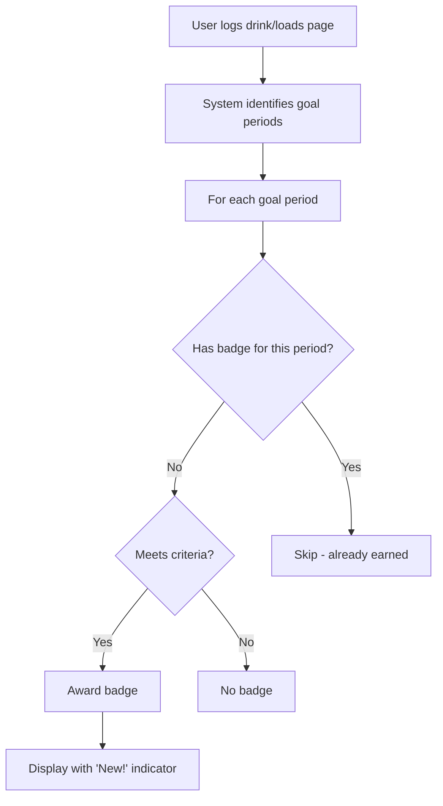

# 🏆 Drink Log Achievements Guide

## Overview

The Drink Log achievement system rewards users for meeting their drinking goals and maintaining healthy habits. Achievements are automatically evaluated and awarded when users log their drinks or when the page loads.

**Key Principle**: You earn **ONE badge per goal period**. When you change your goals (daily, weekly, or monthly targets), a new period begins and you can earn badges again for the new period.

## 🎯 Achievement Types

### 1. 🟣 Alcohol Free Period Badge

**"Alcohol Free Period"**

#### How to Earn

- Have at least **1 day without drinking** within your goal period
- This includes days where you:
  - Logged 0 drinks, OR
  - Didn't log anything (treated as no drinking)

#### Conditions

```
✅ At least 1 day without drinking alcohol
✅ Must be within a goal period (between goal changes)
```

#### Frequency

- **One per goal period** - Earn once between each goal change
- When you update your goals, you can earn this badge again for the new period

#### Example Scenarios

- ✅ **Eligible**: You logged "0 drinks" for any day in your goal period
- ✅ **Eligible**: You have days without any logs (treated as alcohol-free)
- ✅ **Eligible**: It's been 8 days since you set goals and haven't logged any drinks
- ✅ **Eligible**: You logged some days with drinks and some with 0 drinks

---

### 2. 🟢 Daily Target Achievement

**"Daily Target Achievement"**

#### How to Earn

- Stay within your **daily drinking limit** for the entire goal period
- Days without logs are treated as 0 drinks (within target)
- Awarded after at least 1 day in the period

#### Conditions

```
✅ No days exceed your daily_goal
✅ At least 1 day must have passed in the period
✅ Must be within a goal period (between goal changes)
```

#### Frequency

- **One per goal period** - Earn once between each goal change
- When you update your goals, you can earn this badge again for the new period

#### Example Scenarios

- ✅ **Eligible**: Daily goal = 2, you haven't logged any drinks for 8 days → 0 drinks/day
- ✅ **Eligible**: Daily goal = 3, you logged 5 days: 0, 1, 2, 1, 0 → All within target
- ✅ **Eligible**: Daily goal = 3, you only logged days when you drank ≤ 3
- ❌ **Not Eligible**: Daily goal = 2, one day you logged 3 drinks → Over limit

---

### 3. 🟠 Weekly Target Achievement

**"Weekly Target Achievement"**

#### How to Earn

- Your **average weekly consumption** must be within your weekly target
- Calculated as: Total drinks in period ÷ Number of weeks
- Awarded after at least 7 days (1 week) in the period

#### Conditions

```
✅ Average weekly consumption ≤ weekly_goal
✅ At least 7 days must have passed in the period
✅ Must be within a goal period (between goal changes)
```

#### Frequency

- **One per goal period** - Earn once between each goal change
- When you update your goals, you can earn this badge again for the new period

#### Example Scenarios

- ✅ **Eligible**: Weekly goal = 10, 7 days with no logs → 0 drinks/week
- ✅ **Eligible**: Weekly goal = 10, 4-week period, total 35 drinks → Avg 8.75/week
- ✅ **Eligible**: Weekly goal = 14, any period ≥7 days where avg ≤ 14/week
- ❌ **Not Eligible**: Weekly goal = 10, avg 12 drinks/week → Over limit
- ❌ **Not Eligible**: Only 5 days have passed → Need at least 7 days

---

### 4. 🟡 Monthly Target Achievement

**"Monthly Target Achievement"**

#### How to Earn

- Your **average monthly consumption** must be within your monthly target
- Calculated as: Total drinks in period ÷ Number of months (30-day periods)
- Awarded after at least 30 days (1 month) in the period

#### Conditions

```
✅ Average monthly consumption ≤ monthly_goal
✅ At least 30 days must have passed in the period
✅ Must be within a goal period (between goal changes)
```

#### Frequency

- **One per goal period** - Earn once between each goal change
- When you update your goals, you can earn this badge again for the new period

#### Example Scenarios

- ✅ **Eligible**: Monthly goal = 30, 30 days with no logs → 0 drinks/month
- ✅ **Eligible**: Monthly goal = 30, 60-day period, total 50 drinks → Avg 25/month
- ✅ **Eligible**: Monthly goal = 40, any period ≥30 days where avg ≤ 40/month
- ❌ **Not Eligible**: Monthly goal = 30, avg 35 drinks/month → Over limit
- ❌ **Not Eligible**: Only 20 days have passed → Need at least 30 days

---

## 🔄 How the System Works

### Goal Periods

- A **goal period** starts when you set your initial goals
- A **new period** begins each time you change any goal (daily, weekly, or monthly)
- You can earn **ONE of each badge type per goal period**
- Past badges are preserved when you change goals

### Automatic Evaluation

1. **When the page loads**: System checks your goal periods within last 180 days
2. **After logging drinks**: Achievements are re-evaluated for current period
3. **When goals change**: New period begins, new badges become available

### Tracking Period

- Default check: **Last 180 days**
- Evaluates all goal periods within this range
- All calculations use **America/New_York timezone**

### Badge Award Process



---

## 📊 Goal Settings Required

Before you can earn badges, you must set your drinking goals:

| Goal Type        | Description              | Example   |
| ---------------- | ------------------------ | --------- |
| **Daily Goal**   | Maximum drinks per day   | 2 drinks  |
| **Weekly Goal**  | Maximum drinks per week  | 10 drinks |
| **Monthly Goal** | Maximum drinks per month | 30 drinks |

⚠️ **Important Notes**:

- Without goals set, no badges can be earned!
- Changing any goal starts a new period
- You keep all previously earned badges

---

## 🎮 Tips for Earning Badges

### For Alcohol Free Badge

- Take regular breaks from drinking
- Even one day off counts!
- Track consistently to prove your alcohol-free days

### For Daily Target Badge

- Set realistic daily goals
- Log your drinks same day for accuracy
- Remember: 0 drinks = no daily badge (but counts toward Alcohol Free!)

### For Weekly Target Badge

- Plan your week (Sunday-Saturday)
- Spread consumption throughout the week
- Track every drink to ensure accuracy

### For Monthly Target Badge

- Monitor your monthly total regularly
- Consider seasonal events and holidays
- Adjust goals if needed at month start

---

## 🔐 Technical Details

### Idempotency

- Each badge has a unique key preventing duplicates
- System uses `ON CONFLICT DO NOTHING` in database

### Period Keys Format (Updated)

- Alcohol Free: `alcohol_free:goal:<goal_id>:<period_start>`
- Daily Target: `daily:goal:<goal_id>:<period_start>`
- Weekly Target: `weekly:goal:<goal_id>:<period_start>`
- Monthly Target: `monthly:goal:<goal_id>:<period_start>`

### Data Tracked

Each badge stores:

- When it was earned (`earned_at`)
- Goal values at time of earning (`goal_snapshot`)
- Relevant metrics (`metrics`: total drinks, etc.)

---

## ❓ FAQ

**Q: Why didn't I get multiple daily badges for my streak?**
A: You get ONE badge per goal period, not per day. The Daily Target Achievement badge means you stayed within your daily limit for the entire period.

**Q: I haven't drunk in 8 days but got only 1 badge?**
A: You should receive multiple badges! With 8 days of no drinking, you should get:

- Alcohol Free Period (after 1 day)
- Daily Target Achievement (after 1 day)
- Weekly Target Achievement (after 7 days)

**Q: Can I earn the same badge multiple times?**
A: Yes, but only when you start a new goal period by changing your goals. Each period allows one of each badge type.

**Q: What happens if I change my goals?**
A: A new goal period begins immediately. You keep all past badges and can earn new ones for the new period.

**Q: Do I need to log 0 drinks or can I just not log anything?**
A: For the new system, days without logs are treated as 0 drinks. You'll still earn badges for staying sober even without logging.

**Q: How far back does the system check?**
A: By default, 180 days. This evaluates all goal periods within that range.

**Q: What timezone is used?**
A: All calculations use America/New_York (Eastern Time) for consistency.

---

## 🐛 Troubleshooting

| Issue                | Solution                                     |
| -------------------- | -------------------------------------------- |
| No badges appearing  | Ensure you have goals set in Settings        |
| Badges not updating  | Refresh the page or log a new entry          |
| Wrong badge count    | Check timezone - all times are ET            |
| Missing weekly badge | Ensure full Sunday-Saturday week is complete |

---

## 📝 Summary

The achievement system encourages healthy drinking habits by:

1. **Rewarding moderation** - Stay within your goals across the entire period
2. **Celebrating breaks** - Alcohol-free days are recognized
3. **Building consistency** - Track your progress over goal periods
4. **Providing feedback** - Visual rewards for meeting targets
5. **Encouraging goal adjustment** - Change goals to start fresh periods

**Key Takeaway**: You earn ONE badge of each type per goal period. This prevents badge spam while still rewarding consistent healthy behavior. When you adjust your goals to be more challenging (or realistic), you get a fresh start with new badge opportunities!

Remember: The goal isn't to collect badges, but to build sustainable, healthy habits over time. 🌟
